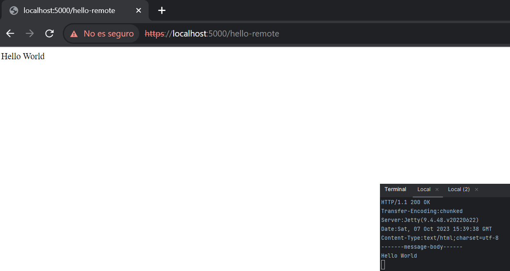
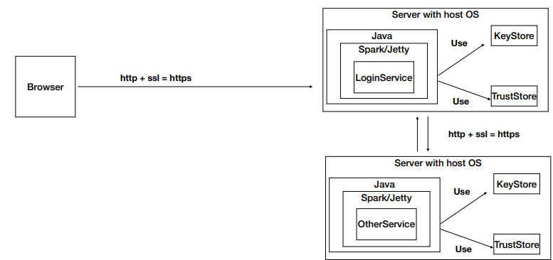
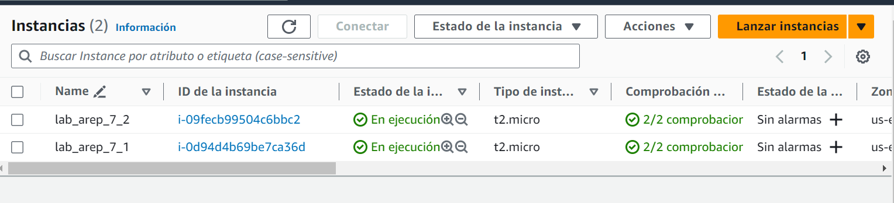
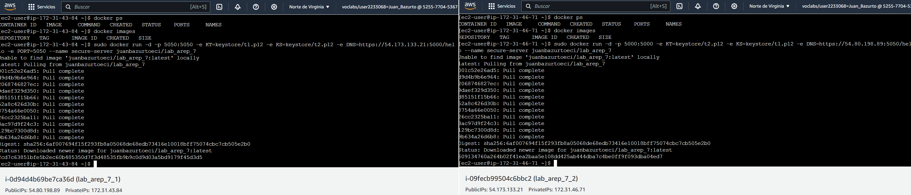
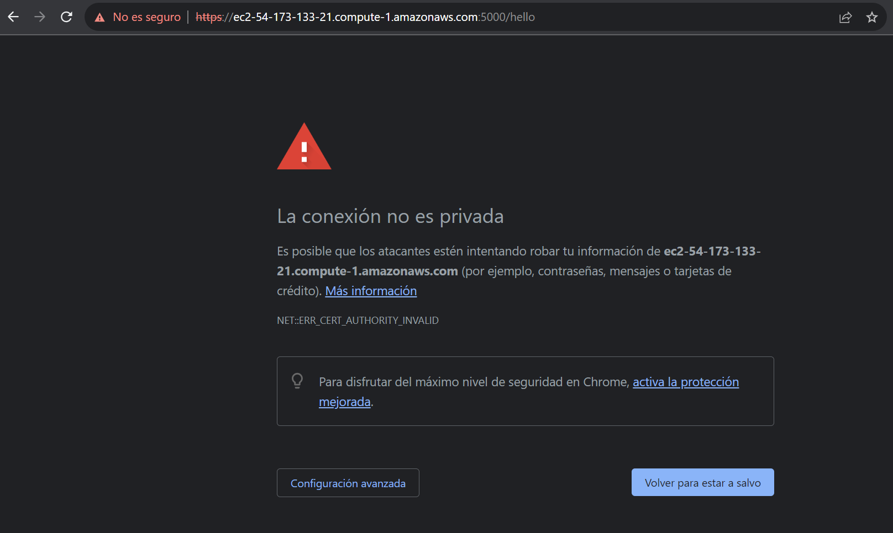
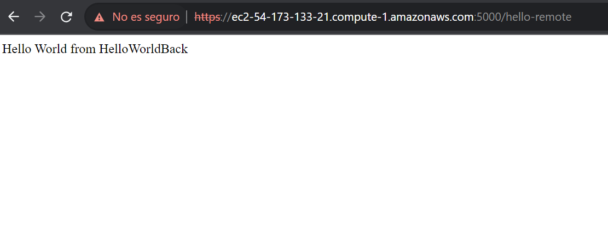
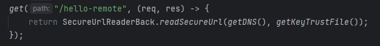

# APLICACIÓN DISTRIBUIDA SEGURA EN TODOS SUS FRENTES

Desarrolle una aplicación Web segura con los siguientes requerimientos:

* Debe permitir un acceso seguro desde el browser a la aplicación. Es decir debe garantizar autenticación, autorización e integridad de usuarios.
* Debe tener al menos dos computadores comunicacndose entre ellos y el acceso de servicios remotos debe garantizar: autenticación, autorización e integridad entre los servicios. Nadie puede invocar los servicios si no está autorizado.
* Explique como escalaría su arquitectura de seguridad para incorporar nuevos servicios.

## Getting Started

Estas instrucciones te ayudarán a obtener una copia del proyecto en funcionamiento en tu máquina local para desarrollo y pruebas. Consulta la sección de "Despliegue" para obtener notas sobre cómo implementar el proyecto en un sistema en vivo.

### Prerequisites

Cosas que necesitas instalar y cómo hacerlo.

- [Java Development Kit (JDK)](https://www.oracle.com/java/technologies/javase-jdk11-downloads.html)
- [Maven](https://maven.apache.org/install.html)
- [DockerDesktop](https://www.docker.com/products/docker-desktop/)

### Installing

Sigue estos pasos para configurar tu entorno de desarrollo:

1. Clona el repositorio:

   ```bash
   https://github.com/juan-bazurto-eci/lab_arep_7.git
2. Navega al directorio del proyecto

    ```
   cd lab_arep_7
   ```

3. Hacemos la construccion del proyecto

   ```
   mvn package
   ```

## Deployment

Ejecutamos los siguientes comandos

    mvn clean package install
    mvn clean install

Corremos el servidor

	 java -cp "target/classes;target/dependency/*" co.edu.escuelaing.arep.HelloWorldBack
     java -cp "target/classes;target/dependency/*" co.edu.escuelaing.arep.HelloWorld

Accedemos a la siguiente URL

	 https://localhost:5000/hello-remote


## Running the tests

El servidor responde a todas las funciones



## AWS

La arquitectura cosntruida para este laboratorio es la siguiente



Configuramos EC2 para el proyecto




Para completar la arquitectura del servidor vamos a generar el certificado para que sea posible establecer el certificado ssl con:

    keytool -genkeypair -alias ecikeypair -keyalg RSA -keysize 2048 -storetype PKCS12 -keystore t1.p12 -validity 3650 -ext SAN=ip:54.173.133.21,ip:54.80.198.89
    keytool -genkeypair -alias ecikeypair -keyalg RSA -keysize 2048 -storetype PKCS12 -keystore t2.p12 -validity 3650 -ext SAN=ip:54.173.133.21,ip:54.80.198.89



Para levantar los contenedores debemos inicializar las variables del PUERTO, DNS, KS y KT en el comando docker run

    sudo docker run -d -p 5000:5000 -e KT=keystore/t2.p12 -e KS=keystore/t1.p12 -e DNS=https://54.80.198.89:5050/hello --name secure-server juanbazurtoeci/lab_arep_7
    sudo docker run -d -p 5050:5050 -e KT=keystore/t1.p12 -e KS=keystore/t2.p12 -e DNS=https://54.173.133.21:5000/hello -e PORT=5050 --name secure-server juanbazurtoeci/lab_arep_7




## Escalabilidad

La arquitectura actual permite agregar mas servidores siempre que puedan tener acceso a la llave en la que deben confiar. solo se debe especificar las variables. esto gracias a que cada servidro son instacias separadas y no deben inteferir

En el caso de querer implementar otro servidor spark solo debe introducirlo en la ruta de este repositorio y especificar las variables de entorno para que se comunique via https a otro servidor como lo muestra la imagen



en este caso getDNS especifica el endpoint del otro servidor y el trustfile es el certificado de dicho dns

Todo esto es ajustable por medio de variables de entorno como se explico en la seccion Dockerfile y Levantar contenedores de este readme

## Built With
* [Java](https://www.java.com/) - Lenguaje de programación principal
* [Maven](https://maven.apache.org/) - Gestión de dependencias y construcción del proyecto
* Git - Control de versiones
* HTML, JavaScript - Interfaz de usuario
* [DockerHub](https://hub.docker.com/)
* [SparkJava](https://sparkjava.com/)
* [MongoDB](https://www.mongodb.com/)
* [Amazon Web Services](https://aws.amazon.com/)

## Authors

* **Juan Camilo Bazurto** - [Linkedin](https://www.linkedin.com/in/juan-camilo-b-b65379105/) - [GitHub](https://github.com/juan-bazurto-eci)